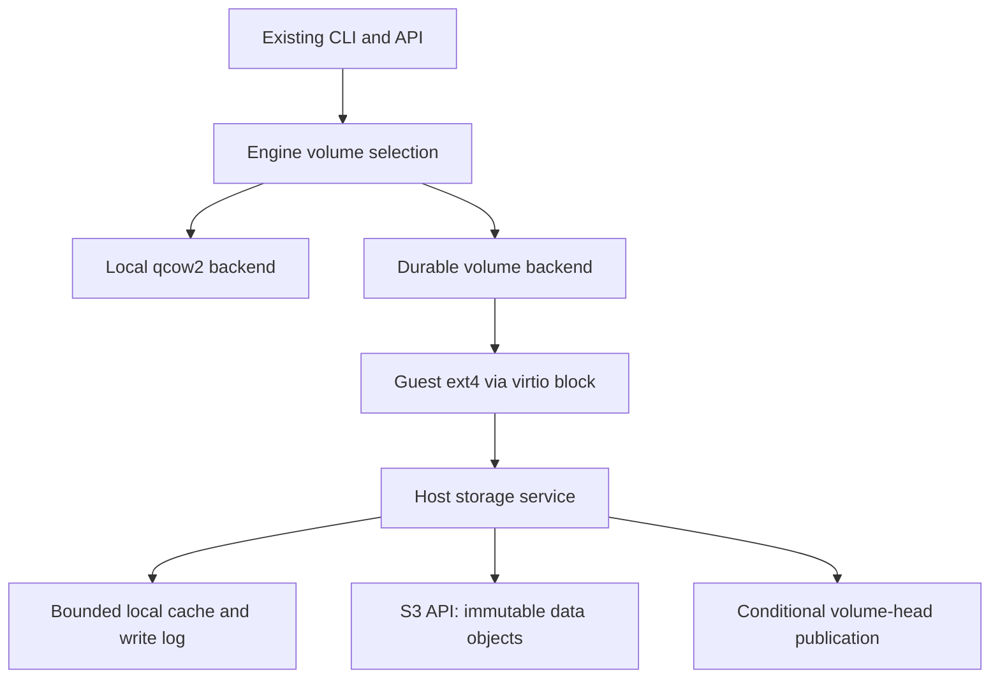

# Local and durable storage

Status: engine integration, storage controls and host resource accounting are
implemented. Full-image Cloud qualification is in progress; automatic placement,
wake and dashboard visibility are not yet enabled.
Owner-approved contract updated 2026-09-13: local durable writes with eventual
object-store replication. Host-disk loss may lose unreplicated changes. No Jira
ticket was supplied; this document is the scoped work item until one exists.

## Product decisions

- Keep local storage as the self-hosted default. No external account is required.
- Add a durable storage backend using an S3-compatible object API. Qualify R2
  first; do not claim compatibility with another provider until its tests pass.
- Choose the storage mode at VM creation and persist it. Moving a VM between
  modes is out of scope. Existing records continue to mean local storage.
- Keep create/exec/shell/stop/start/delete commands the same. Host configuration
  selects the default. Expose mode and last confirmed durability status through
  get/status, without displaying credentials or bucket configuration to guests.
- AHVM Cloud switches its default only after the durable backend is qualified.
  Selecting durable storage on an unconfigured host must fail, never fall back.
- Replication maintains the current disk; explicit checkpoints retain history.
  No scheduled backup requirement. The independent manual restic backup remains
  useful for operator/control-plane recovery, not the live disk implementation.

## Durability contract

The production target is **local durability with eventual remote replication**.
A successful guest flush/fsync or FUA persists the corresponding writes to the
host journal. It does not promise that R2 already has them. Ordinary writes that
have not been flushed may also be lost in a process/power failure.

Background replication publishes ordered, atomic remote disk generations. A
permanent loss of the host disk may lose locally synced writes newer than the
last remote generation. The replication delay is not a guaranteed one-second
loss window: slow or unavailable R2 can extend it. Reads on the current writer
see its own writes immediately; this is eventual *durability*, not stale local
read consistency.

Provide a separate remote-sync barrier and status watermark. Planned migration,
checkpoint creation and any operation promising remote recovery must wait for
that barrier, or fail explicitly. A plain guest fsync must not wait for R2.
Bound journal/backlog growth and apply write backpressure if it fills; do not
silently discard pending writes. Local disk or journal errors fail local fsync.

Retain the strict remote-flush implementation as an experimental reference/test
path, not as the default product target. The earlier phase-1/2/3 remote-flush
results remain valid for that stronger contract; they do not describe the new
default. Device ordering, FUA/discard/zeroing and host ownership still require
qualification before customer integration.

Cold recovery restores the disk and starts services anew. RAM snapshots are
optional and do not determine disk correctness. A cold restart does not preserve
open network connections or application memory. Crash-consistent ext4 is not an
application-consistent snapshot unless the application has flushed its data.

## Architecture



Each volume has a stable ID, immutable data objects, immutable metadata generations
and a small mutable head. Upload data before publishing a map that references it.
Advance the head atomically against an opaque prior revision. A failed upload
leaves the previous committed disk readable; an ambiguous head response requires
reconciliation, not an unconditional retry. The first prototype embeds a bounded
map directly in the head; a persistent indexed map replaces it before large disks.

Reads resolve the committed map and download only requested data. Local cache
files are disposable only after dirty data has reached a remote commit. Validate
object lengths and hashes; missing referenced data is corruption, never a zero
block. Zero holes are explicit absent map entries. Initial deduplication is
volume-scoped; cross-tenant deduplication is excluded. Shared read-only images
need an immutable, independently verified base manifest and explicit references.

Control-plane ownership and storage publication must share a fenced ownership
epoch. Acquiring a new writer must invalidate old writers before a replacement VM
can run. A head compare-and-swap prevents lost updates but is not, by itself,
complete split-brain prevention. A displaced host must also stop serving stale
guest I/O. Do not implement automatic failover until this is demonstrated under
partitions, delayed requests and lost responses.

Use a dedicated private bucket for qualification, separate from public images
and the restic repository. Credentials stay in the host service, scoped to the
needed bucket/prefix operations, never in guests, CLI responses or logs. Define
encryption/key recovery before pilot activation. Bounded cache/dirty data and
per-volume accounting replace assumptions that a local qcow2 tree is the whole
storage budget. Quota enforcement is still needed for local files, logs and RAM.

## Phases and exit gates

| Phase | Work | Exit gate |
| --- | --- | --- |
| 1: protocol foundation | This plan; separate experimental Rust crate; bounded chunk map and object-store interface; deterministic failures and conflicting publications | Reopen without client state; failed uploads leave prior head intact; ambiguous responses force reopen; concurrent commits have one winner; corrupt data fails closed. Existing runtime is unaffected. |
| 2: S3/R2 adapter | Private qualification bucket; scoped credential loading; signed S3 requests; bounded streams/timeouts; conditional writes and reconciliation; independent-process recovery tool | Real R2 round trips, lost responses, competing clients, cache deletion and a fresh process recover acknowledged data. Prove provider preconditions, not merely SDK support. No VMs yet. |
| 3: guest disk integration | Select Linux block attachment after a small NBD/ublk versus direct VMM adapter spike; indexed metadata; bounded local cache/write log; background upload; flush barrier; raw ext4 volume | One 1-vCPU/1-GiB disposable VM boots, runs Git/package installs/SQLite, and recovers synced writes after abrupt compute/storage termination and cache removal. R2 outage permits local fsync but never a false remote-sync acknowledgement; host-journal loss explicitly demonstrates loss of unreplicated data. |
| 4: coexistence and ownership | Engine local/durable interface; immutable per-VM mode; persisted volume ID; explicit capabilities; fenced writer acquisition; create/start/stop/delete recovery; status fields | Local conformance unchanged; durable unavailable fails closed; old host cannot publish or continue serving after takeover; interrupted lifecycle cannot orphan unaccounted writable storage. No mode conversion. |
| 5: checkpoints and space reclamation | Immutable map roots; explicit checkpoints; safe deletion/GC with active-writer roots, grace periods and crash recovery; base-image sharing; cache/remote quotas | Referenced objects are never reclaimed; ordinary syncing does not retain unlimited history; deletes and checkpoint retention release space; concurrent commits/GC survive interruption. |
| 6: qualification and cloud rollout | R2 request/byte accounting, latency/backpressure benchmarks, security review, second-host recovery, install/config/docs; optional self-hosted S3 configuration | Defined performance/cost budget; host-loss recovery tested on another host; pilot cloud opt-in first, then default. Public local mode requires no object store. |

Phases 3 and 4 may need interface adjustments from the attachment spike. Breaking
disk formats are allowed during the experiment; release formats must be versioned
and unsupported formats rejected. Do not release a durable CLI flag ahead of its
backend. No production deployment, new release or automatic host reassignment is
part of phase 1.

## Phase 1 implementation and limits

`rust/ahvm-volume` implements a synchronous, bounded protocol model. It uses
64-KiB chunks, a maximum 64-MiB logical disk and a maximum 128-KiB manifest. Those
are experiment limits, not proposed product quotas or performance tuning. Pending
writes live only in RAM. Explicit commit uploads chunks then conditionally
publishes the complete map. A dropped handle can reopen from the object-service
model; uncommitted writes are deliberately lost. Immutable unused objects are
left behind until GC is designed; do not use this for long-running storage.

The test store is in memory and simulates an independent object service. This
proves protocol behavior, not physical durability, process-crash recovery, S3
compatibility, hardware fencing, fsync semantics, encryption or performance. No
new dependency is added to the CLI, daemon or VMM, and no R2 credentials/buckets
or running services are changed by this phase. The existing quota-broker
`StorageConfig` remains separate from the future volume-backend configuration.

Run: `cargo test --manifest-path rust/Cargo.toml -p ahvm-volume`.

## Phase 2 implementation

The private S3 adapter and independent-process qualification tool are implemented.
See [R2 qualification](DURABLE-STORAGE-R2.md) for setup, evidence and limitations.
This is still an isolated protocol experiment, not a production disk backend.

## Phase 3 progress

The [NBD guest data-disk spike](../experiments/durable-storage/README.md) proves
real guest ext4 recovery and fsync failure under an R2 network outage. It uses
the unchanged VMM and a local root disk with a small durable data disk. Indexed
metadata, bounded RAM caching/dirty buffers and background upload now have a
[format-2 implementation and full-root gate](../experiments/durable-storage/INDEXED-ROOT.md).
The full-root gate now also covers three repeated synced-write/SIGKILL/recovery
cycles and records cold/warm latency. Small synchronous commits remain slow even
with a warm cache. The [eventual-durability continuation](../experiments/durable-storage/EVENTUAL.md)
adds the local write log and changes the target contract. The continuation adds
connectivity-recovery coverage and a full-backlog drain/admission regression.
Guest zeroing/discard-reuse and remote-only byte checks pass with an appended
disposable tail. These checks qualify the guest-disk foundation. Large/scattered R2 backlog
throughput and persistent clean caching remain before rollout.

## Phase 4 progress

The [engine integration](../experiments/durable-storage/ENGINE.md) adds immutable
mode/volume identity, a host service seam, cold replicated lifecycle and status.
Local mode remains the public default. The opt-in Rust NBD/R2 service now
implements ownership, supervision and restart recovery. Tenant accounting,
remote reclamation and daemon/CLI selection remain before cloud activation.

The [ownership core](../experiments/durable-storage/OWNERSHIP.md) adds a format-4
head envelope that atomically publishes the owner epoch and disk map. It supports
explicit drain/release and same-identity journal recovery after process death.
Concurrent/lost-response cases and independent-process R2 handoff are qualified.
The isolated engine supervisor now uses this ownership core. Supervisor restart
adopts the surviving worker; dead-worker replacement refuses while a VM holds
the disk open. The original identity/journal are reused after observed VM death.
There is deliberately no timed or forced takeover. The Rust service below adds
production supervision and engine/VM binding; the Python adapter is historical
qualification tooling. Ownership release/deletion and tenant accounting still
need rollout integration.

## Qualification measurements

Before setting a production default, measure cold reads/boot, hot reads, small
random writes, sequential writes, fsync p50/p95/p99, SQLite commit latency, git
clone/checkout, package installation, memory/cache pressure, catch-up after an
outage, and API/R2 request counts. A large upload benchmark alone is insufficient.
Do not upload one tiny object per guest write; quantify batching and metadata
amplification. Record the most important numbers in Markdown, not giant results
files. Use at most one small VM in the initial spike and two for isolation checks.

## Source notes

- [R2 S3 compatibility](https://developers.cloudflare.com/r2/api/s3/api/):
  PutObject conditional headers are listed. Phase 2 must probe their actual
  behavior with the chosen Rust client and use opaque ETags.
- [R2 consistency](https://developers.cloudflare.com/r2/reference/consistency/):
  object consistency is not a multi-object transaction. Publish the head last;
  access the private S3 endpoint directly, not a cached public hostname.
- [Sprites original design](https://fly.io/blog/design-and-implementation/)
  separated chunks from metadata and used local storage as a cache.
- [Sprites newer backend](https://fly.io/sprites/) describes an object-backed
  block device; the [earlier Litestream description](https://fly.io/blog/litestream-writable-vfs/)
  explicitly described eventual durability. Do not copy marketing language as
  a zero-data-loss promise or assume that description specifies today's backend.

R2 is the first qualified provider, not a hard dependency of AHVM. A self-hosted
object store on the same physical machine does not provide host-loss protection.

### Rust service integration

[`ahvm-volumed`](VOLUME-SERVICE.md) replaces the single-volume Python adapter with
a multi-volume Rust supervisor, durable gated child launch, explicit sandbox/VM
binding and automatic storage recovery after verified VM termination. It ships
as an opt-in server binary/unit, not an enabled cloud default. Tenant accounting,
remote reclamation/ownership release, and daemon/API configuration remain before
rollout. Local mode remains the default.

### Capacity admission and intended CLI

The Rust service now reserves logical disk capacity, journal space (including
compaction) and clean-cache payload before import, with explicit host budgets.
Reservations are rebuilt from durable records and remain charged until data is
reclaimed, including failed imports and tombstones. This is the host foundation;
tenant ownership/quota wiring, remote-byte accounting and GC are still outstanding.
See [service accounting](VOLUME-SERVICE.md#capacity-admission-and-accounting).

The API/CLI slice implements this self-hosted flow. See [current limits and defaults](STORAGE.md):

```bash
# Self-hosted: local remains the default, no object store needed.
ahvm create dev

# Only on a host configured by its operator for replicated storage.
ahvm create durable-dev --storage replicated --no-shell
ahvm shell durable-dev
# Run exit to return to your computer before the following commands.
ahvm get durable-dev                 # mode, pending bytes, replication health
ahvm stop durable-dev
ahvm storage sync durable-dev        # explicit barrier, currently stopped only
ahvm start durable-dev               # same disk; cold boot, no RAM promise
ahvm delete durable-dev
```

Normal writes/fsync remain local and replication runs in the background. The
explicit barrier must report failure if remote durability cannot be confirmed;
it is not a named historical checkpoint. Cloud selects replicated storage by
policy after rollout qualification, so users need no bucket credentials or
storage flag. Self-hosted operators configure their own S3-compatible storage;
mode remains immutable at creation. Keep these commands separate from manual
control-plane backups. Breaking experimental changes are allowed where they
simplify correctness; no compatibility migration is required for test records.


### Phase 5 first slice: deleted-volume reclamation

The Rust supervisor now automatically reclaims deleted, detached volumes. It
publishes a permanent format-5 retirement marker using the head CAS, refuses a
live/foreign owner, deletes bounded batches of volume-scoped chunks, and releases
host reservations after confirmed remote and local cleanup. Interrupted work is
retryable. Tiny identity markers remain; running volumes and their obsolete
historical blocks are not collected by this first slice. See
[reclamation details](VOLUME-SERVICE.md#deleted-volume-reclamation).

Next: reference-aware collection of obsolete blocks for still-existing volumes,
then idle local eviction after remote sync, tenant accounting and API/CLI rollout.
Do not conflate remote chunk deletion with evicting a disposable local cache.

### Checkpoint expiration decision

Checkpoints will support a configurable retention duration recorded as an absolute
`expires_at`, with a finite cloud default chosen before enabling checkpoints.
Expiration removes a retained historical root; it never expires the current disk.
The collector may delete a block only when no current disk, unexpired checkpoint,
active publication or other supported reference needs it. Expiration and reader/
restore admission must be serialized so an admitted restore retains its source.
Cleanup failures delay physical deletion and do not revive an expired checkpoint.
Do not implement this as a bucket-wide object age rule. Checkpoint metadata and
the new root/reference format must land together with a collector that understands
them; the deleted-volume-only collector must not silently process newer formats.
CLI syntax such as `ahvm checkpoint create dev --expires-in 7d` is illustrative,
not an implemented command or a selected seven-day policy. No scheduled backups
or checkpoint creation are introduced by retention support.


### Phase 5 continuation: stopped-disk reference collection

Existing disks now receive reference-aware cleanup during explicit stopped/detached
windows. The collector keeps current metadata/data, refuses pending journals and
unknown checkpoint schemas, and holds exclusive ownership through each pass.
Generation-bound marking avoids re-reading metadata for every batch. Foreground
mutations cancel collection and briefly wait for it to yield; running VMs are not
paused. See [stopped-disk collection](VOLUME-SERVICE.md#obsolete-blocks-on-stopped-disks).

The current disk-only reclamation path is now present for deleted disks and
stopped existing disks. Continuous online collection and actual checkpoint roots/
expiry are not implemented. Next is idle local eviction after confirmed remote
sync, keeping the disk remotely persistent, followed by tenant accounting and
normal API/CLI rollout. Checkpoint support must extend the retained-root format and
collector together before activation; a TTL must never expire the current disk.


### Phase 5 continuation: idle local eviction

Stopped replicated disks now finish offline collection and remote sync, then evict
the local journal and release journal/cache/device reservations. The current R2
disk and a small host owner identity remain. Attach atomically readmits local
resources and lazily fetches data, without reimporting the source image. Interrupted
removal is recoverable; failed sync keeps pending data and reservations. See
[idle local eviction](VOLUME-SERVICE.md#idle-local-eviction).

Next: tenant accounting and normal daemon/API/CLI rollout, with cloud selecting
replicated storage automatically and self-hosted local storage unchanged. Named
checkpoint roots/expiration remain a separate format+collector extension. Current
remote logical capacity accounting remains conservative, not measured R2 usage.

### Tenant accounting foundation

`ahvm-store` now has a durable replicated-disk reservation ledger, separate from
sandbox lifecycle rows. Before import, the caller reserves an immutable volume
ID, authenticated owner, sandbox binding and validated logical image size in an
IMMEDIATE SQLite transaction. The existing user's `max_volumes_mb` bounds the
sum of retained replicated capacity and separately recorded volumes. Independently
opened connections cannot overbook concurrent replicated admissions. This is
logical capacity accounting, not R2 object-byte billing or filesystem preallocation.

Reservations survive failed creates, missing sandbox rows, process restarts, idle
stops and local eviction. Deletion intent remains charged until a trusted caller
confirms the volume supervisor has completed remote and local reclamation.
Reclaimed identities remain as tombstones and cannot be reused; sandbox names
can be reused with fresh identities after cleanup. The owner foreign key is
restrictive: account deletion must not cascade away storage ownership/accounting.
A bounded retained-reservation scan supports startup and deletion reconciliation.

This is a store foundation, not enabled tenant enforcement for current endpoints.
Next integration must mint the volume ID before engine create, use authenticated
ownership and trusted image sizing, persist the reservation before remote writes,
reconcile ambiguous/failed creates against engine/supervisor records, and release
quota only on a verified reclamation result. Do not expose the confirmation method
as a user API or release quota on a delete acknowledgement. The existing detached
volume CRUD API is not upgraded into a new public storage product by this change.
After that wiring: storage selection/status/sync in daemon and CLI, automatic
Cloud selection, and automatic wake through authenticated resource admission.

Validation: store tests cover independent-connection contention, database reopen,
owner isolation, immutable identity/size, reduced/invalid quotas, shared existing
volume capacity, delayed reclamation and bounded recovery pagination. No VM or
object-store operations are needed for this foundation.

### Tenant deletion and reclamation integration

Daemon deletion now marks a matching replicated reservation as deleting before
calling the backend. A separate background task reconciles one bounded page every
60 seconds, respecting lifecycle fences/locks and operation permits. It retains
the charge on pending cleanup, missing proof, unknown ownership and RPC failure.
Only explicit supervisor confirmation permits removing leftover sandbox metadata
and confirming reclamation in the ledger. No disk I/O path gains database work.

The new host-only retirement handshake also covers a reservation whose create
never reached volume-service registration. It records deletion without importing
an image or taking an NBD slot, then uses the same ownership-fenced remote
retirement and chunk collector. An absent service record alone is not proof of
cleanup. Existing live/retained backend disks and mismatched identities are
refused. A previously failed destroy can finish through this handshake.

`AHVM_VOLUME_SOCKET` explicitly configures this service connection on the daemon;
it does not enable replicated creation or change the local default. The remaining
create-side work must reserve identity and trusted sizing before remote import,
carry that sizing through retries, and reconcile failed/ambiguous creates. Public
storage selection/status/sync, automatic Cloud selection and wake remain pending.

Qualification on agent_house used an isolated daemon, volume service and R2 with
one 64-KiB logical reservation and no VM. A never-registered disk became a permanent
remote retirement marker; the daemon retained its charge after the acknowledgement
and released it after restart and explicit cleanup confirmation. The probe took
1.11 seconds; this is an empty-disk correctness check, not deletion throughput or
cold-boot timing. One small retirement marker remains, with no data chunks.

### Create-time tenant admission

The daemon now uses a backend admission callback before replicated import. The
engine validates the image, mints its immutable volume ID and supplies the logical
size; the daemon reserves that capacity for the authenticated owner in SQLite.
Quota refusal returns HTTP 403 without creating a sandbox directory or contacting
the volume service. The admitted size is persisted in the engine record and sent
on preparation retries; the service refuses changed sizing before allocation.
This adds one admission transaction per create, not per disk read or write.

The lifecycle lock, operation permit, resource hold and sandbox-row commit remain
with the blocking create task if its HTTP client disconnects. Failed creates mark
their reservation deleting; crashes before the sandbox-row commit are recovered
by the bounded reservation sweep. Both remain charged until the existing explicit
reclamation proof arrives. Cleanup checks the engine's immutable volume identity.
A retained disk also blocks reuse of its sandbox name by any owner, including
local create and snapshot restore. Recovery removes only known early-create
temporary metadata; unrecognized contents remain untouched.

Validation uses small local image files, without creating VMs or uploading images:
engine admission refusal and retry sizing, volume-service size mismatch before
registration and on retry, HTTP quota refusal and charged failed creation, orphan
versus committed-row reconciliation, and interrupted-create directory cleanup.
Linux ordinary suites, privileged volume-service tests and clippy run on
agent_house; installed services are unchanged.

Next: expose storage mode, replication status and explicit sync in the daemon and
CLI; finish host resource integration before enabling automatic replicated mode
for Cloud, then authenticated automatic wake. Follow with dashboard disk/status
visibility and admin storage/cleanup controls in the private site repository.
Local storage remains the default here. Named checkpoint expiry is still a
separate collector/format extension. No new release or deployment in this slice.


### API and CLI storage controls

Self-hosted create accepts explicit local/replicated mode, with feature negotiation
to prevent older daemons ignoring the new field. Get responses include live storage
state; list remains a metadata-only operation. Owner-scoped storage status and sync
routes expose admitted capacity and replication state. Sync remains stopped-only,
with lifecycle serialization and operation admission retained after disconnection.

The website documentation and [storage guide](STORAGE.md) describe local defaults,
sizing, Bash, idle-stop, cold replicated restart, pending writes and Cloud rollout
limits. This slice does not enable the volume service through the standard installer
or change Cloud defaults. Next: host resource integration and automatic Cloud
selection/wake, then dashboard user/admin storage visibility.

### Host resource integration

Replicated VMs now coexist with VM cgroups and the local metadata quota broker.
The engine checks a private volume-service enforcement proof before admission,
start and adoption; an older or unbounded service is refused. Metadata quota
prepare/verify/release and empty VM-group cleanup use the existing control paths.

Volume workers and NBD clients enter a separate per-volume cgroup before launch.
The service verifies exact limits on adoption/control probes, and retains failure
if a populated group cannot be removed. A persistent worker unit survives supervisor
restart; finite supervisor ceilings also cover import/collection. Pool admission
checks enough aggregate RAM/task ceiling for all configured NBD slots. Existing
logical disk/journal/cache budgets remain in force.

No Cloud defaults or installed services change in this slice. Next is deploying
the bounded volume state filesystem and services for Cloud, routing Cloud create
to replicated mode and implementing automatic wake, then full guest qualification
and dashboard visibility. Final capacity planning must include guest/VMM, storage
worker and supervisor headroom; this change is not a production capacity estimate.

### Cloud storage selection and deployment preparation

Durable lifecycle create requests now carry an optional storage mode. The mode
is part of the canonical receipt, so a retry cannot change it. Omitted fields
preserve old receipt payloads; unsupported replicated requests never become local
creates. Nodes advertise `lifecycle-storage-v1` for this extension.

The private Cloud change freezes host-selected storage in each new sandbox and
create operation. Existing hosts/disks default to local. Replicated placement
checks node support before reserving capacity, and admission fences concurrent
host-policy changes. Customers do not choose the Cloud storage backend.

Cloud deployment templates add a bounded volume-state mount, separate supervisor
and persistent disk workers, and aggregate headroom. On agent_house, the disposable
128-MiB gate proved missing-mount refusal, filesystem ENOSPC, positive resource
proof and supervisor restart. It used no VM, disk attachment or R2 requests, and
removed its temporary units, mount and newly loaded NBD module.

This prepares activation; it does not switch the live Cloud host. After merging,
install the bounded pool and scoped production credentials, qualify one real guest
through create/write/stop/evict/start/delete, then activate replicated placement.
Authenticated automatic wake and dashboard replication status remain next.


### Live Cloud deployment qualification

The pilot now has a private bucket, scoped host credentials, a bounded 8-GiB
volume-state filesystem, two NBD slots and separate capped supervisor/worker
services. The control-plane storage-mode migration is deployed, with the host
still selecting local storage. Quota-broker lock provisioning, canonical engine
paths and supervisor restart dependencies were corrected during deployment.

The full Ubuntu developer-image test demonstrated guest writes, volume supervisor
restart, daemon adoption and stopped remote sync. Initial create took 594.28 seconds;
stop took 2.10 seconds. Unlike the earlier small-image tests, remote collection
exceeded the initial three-minute eviction wait and finished about 9 minutes
24 seconds after stop. Cold start then took 13.47 seconds and preserved the file.
Retired test chunks received verified operator bulk cleanup; native full-image
deletion throughput remains unqualified. See the volume-service guide and private
deployment runbook for qualification evidence.

Before activating automatic replicated Cloud storage, implement reusable verified
base images so every new VM does not upload the full developer image. Measure
full-image eviction and cold-start latency separately. The independent operator
backup/recovery procedure also needs to include the installed volume-service state.
Then finish automatic wake and user/admin dashboard visibility, followed by the
invited-user end-to-end gate and release. Local-mode Cloud remains available while
these requirements are completed.


### Shared base images and local reads

Shared immutable image catalogs now back new replicated disks. A root-only warm
command publishes a base once through the bounded supervisor. New VMs pin its
catalog and store only private changes. Local host images serve verified base
blocks, with remote fallback when absent or changed. Per-VM collection no longer
scans the full image. Existing volumes keep their format and ownership semantics.

See [shared base images](SHARED-BASE-IMAGES.md) for protocol, operator workflow and
qualification. This is part of Cloud storage qualification, not dashboard work.
Bases remain operator-retained until reference-aware base deletion is implemented.
A bounded prebooted pool is a later create-latency optimization; it is not required
for shared image storage. Automatic wake and dashboards remain pending.

Planned prebooted pool: start with Ubuntu without a desktop, keep the number of
clean unassigned VMs configurable and bounded, and account for their host resources.
Allocate tenant ownership atomically when an image/resource profile matches.
Never recycle a previously assigned VM's tenant state into the pool. This remains
a later optimization after shared-base qualification and automatic Cloud wake.

### Portable recovery export

The root-only `export-remote` command materializes one published disk into a
standalone raw image with a SHA-256 manifest. It verifies base/private chunks,
refuses concurrent head changes and never changes ownership. Independent restore
is tested after removal of all source objects. See [export guide](REPLICATED-EXPORT.md).
This supplies the disk portion of intentional recovery; the Cloud backup guard
remains until metadata capture and real-guest restore are integrated. Automatic
wake and dashboards follow; further boot-performance and desktop qualification
are deferred as requested.

### Cloud wake network policy

Replicated start now applies the same persisted per-VM bandwidth policy as local
start. Policy changes still require a stopped VM; the gateway is replaced before
boot and storage mode/volume identity remain unchanged. This closes a live Cloud
wake failure where durable start receipts carried a policy that replicated start
rejected. The private Cloud wake gate read a saved marker after authenticated
wake in 7.724 seconds with one start record and one guest dispatch. Cloud default
activation and dashboard qualification remain separate.
