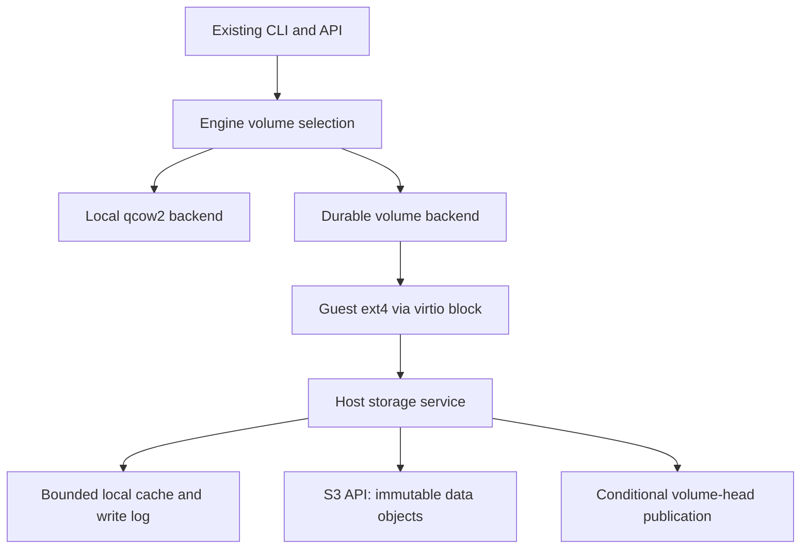

# Local and durable storage

Status: phase 1 prototype. Owner-approved direction, 2026-09-12. No Jira ticket
was supplied; this document is the scoped work item until one exists.

## Product decisions

- Keep local storage as the self-hosted default. No external account is required.
- Add a durable storage backend using an S3-compatible object API. Qualify R2
  first; do not claim compatibility with another provider until its tests pass.
- Choose the storage mode at VM creation and persist it. Moving a VM between
  modes is out of scope. Existing records continue to mean local storage.
- Keep create/exec/shell/stop/start/delete commands the same. Host configuration
  selects the default. Expose mode and last confirmed durability status through
  get/status, without displaying credentials or bucket configuration to guests.
- AHVM Cloud switches its default only after the durable backend is qualified.
  Selecting durable storage on an unconfigured host must fail, never fall back.
- Replication maintains the current disk; explicit checkpoints retain history.
  No scheduled backup requirement. The independent manual restic backup remains
  useful for operator/control-plane recovery, not the live disk implementation.

## Durability contract

An ordinary buffered write is not a promise of survival after host loss. The
initial production target is that a successful guest flush/fsync reaches an
off-host durable commit of both data and its disk map. Every filesystem/VMM/device
layer must preserve ordering and flush semantics. Never advertise this guarantee
based only on a storage-library test. FUA/discard/zeroing must also be handled or
explicitly not advertised by the device.

Background upload batches reduce dirty data and amortize object requests. Flush
waits for the corresponding batch to become remotely durable; clean stop and
checkpoint wait for a durable commit too. If the store is unavailable, cap dirty
bytes, apply backpressure, and fail/hold the flush rather than acknowledge local
data as remote-durable. Whether to offer weaker asynchronous durability later is
a separate product decision, not a hidden performance optimization.

Cold recovery restores the disk and starts services anew. RAM snapshots are
optional and do not determine disk correctness. A cold restart does not preserve
open network connections or application memory. Crash-consistent ext4 is not an
application-consistent snapshot unless the application has flushed its data.

## Architecture

Each volume has a stable ID, immutable data objects, immutable metadata generations
and a small mutable head. Upload data before publishing a map that references it.
Advance the head atomically against an opaque prior revision. A failed upload
leaves the previous committed disk readable; an ambiguous head response requires
reconciliation, not an unconditional retry. The first prototype embeds a bounded
map directly in the head; a persistent indexed map replaces it before large disks.

Reads resolve the committed map and download only requested data. Local cache
files are disposable only after dirty data has reached a remote commit. Validate
object lengths and hashes; missing referenced data is corruption, never a zero
block. Zero holes are explicit absent map entries. Initial deduplication is
volume-scoped; cross-tenant deduplication is excluded. Shared read-only images
need an immutable, independently verified base manifest and explicit references.

Control-plane ownership and storage publication must share a fenced ownership
epoch. Acquiring a new writer must invalidate old writers before a replacement VM
can run. A head compare-and-swap prevents lost updates but is not, by itself,
complete split-brain prevention. A displaced host must also stop serving stale
guest I/O. Do not implement automatic failover until this is demonstrated under
partitions, delayed requests and lost responses.

Use a dedicated private bucket for qualification, separate from public images
and the restic repository. Credentials stay in the host service, scoped to the
needed bucket/prefix operations, never in guests, CLI responses or logs. Define
encryption/key recovery before pilot activation. Bounded cache/dirty data and
per-volume accounting replace assumptions that a local qcow2 tree is the whole
storage budget. Quota enforcement is still needed for local files, logs and RAM.

## Phases and exit gates

| Phase | Work | Exit gate |
| --- | --- | --- |
| 1: protocol foundation | This plan; separate experimental Rust crate; bounded chunk map and object-store interface; deterministic failures and conflicting publications | Reopen without client state; failed uploads leave prior head intact; ambiguous responses force reopen; concurrent commits have one winner; corrupt data fails closed. Existing runtime is unaffected. |
| 2: S3/R2 adapter | Private qualification bucket; scoped credential loading; signed S3 requests; bounded streams/timeouts; conditional writes and reconciliation; independent-process recovery tool | Real R2 round trips, lost responses, competing clients, cache deletion and a fresh process recover acknowledged data. Prove provider preconditions, not merely SDK support. No VMs yet. |
| 3: guest disk integration | Select Linux block attachment after a small NBD/ublk versus direct VMM adapter spike; indexed metadata; bounded local cache/write log; background upload; flush barrier; raw ext4 volume | One 1-vCPU/1-GiB disposable VM boots, runs Git/package installs/SQLite, and recovers synced writes after abrupt compute/storage termination and cache removal. R2 outage never returns a false durable flush. |
| 4: coexistence and ownership | Engine local/durable interface; immutable per-VM mode; persisted volume ID; explicit capabilities; fenced writer acquisition; create/start/stop/delete recovery; status fields | Local conformance unchanged; durable unavailable fails closed; old host cannot publish or continue serving after takeover; interrupted lifecycle cannot orphan unaccounted writable storage. No mode conversion. |
| 5: checkpoints and space reclamation | Immutable map roots; explicit checkpoints; safe deletion/GC with active-writer roots, grace periods and crash recovery; base-image sharing; cache/remote quotas | Referenced objects are never reclaimed; ordinary syncing does not retain unlimited history; deletes and checkpoint retention release space; concurrent commits/GC survive interruption. |
| 6: qualification and cloud rollout | R2 request/byte accounting, latency/backpressure benchmarks, security review, second-host recovery, install/config/docs; optional self-hosted S3 configuration | Defined performance/cost budget; host-loss recovery tested on another host; pilot cloud opt-in first, then default. Public local mode requires no object store. |

Phases 3 and 4 may need interface adjustments from the attachment spike. Breaking
disk formats are allowed during the experiment; release formats must be versioned
and unsupported formats rejected. Do not release a durable CLI flag ahead of its
backend. No production deployment, new release or automatic host reassignment is
part of phase 1.

## Phase 1 implementation and limits

`rust/ahvm-volume` implements a synchronous, bounded protocol model. It uses
64-KiB chunks, a maximum 64-MiB logical disk and a maximum 128-KiB manifest. Those
are experiment limits, not proposed product quotas or performance tuning. Pending
writes live only in RAM. Explicit commit uploads chunks then conditionally
publishes the complete map. A dropped handle can reopen from the object-service
model; uncommitted writes are deliberately lost. Immutable unused objects are
left behind until GC is designed; do not use this for long-running storage.

The test store is in memory and simulates an independent object service. This
proves protocol behavior, not physical durability, process-crash recovery, S3
compatibility, hardware fencing, fsync semantics, encryption or performance. No
new dependency is added to the CLI, daemon or VMM, and no R2 credentials/buckets
or running services are changed by this phase. The existing quota-broker
`StorageConfig` remains separate from the future volume-backend configuration.

Run: `cargo test --manifest-path rust/Cargo.toml -p ahvm-volume`.

## Qualification measurements

Before setting a production default, measure cold reads/boot, hot reads, small
random writes, sequential writes, fsync p50/p95/p99, SQLite commit latency, git
clone/checkout, package installation, memory/cache pressure, catch-up after an
outage, and API/R2 request counts. A large upload benchmark alone is insufficient.
Do not upload one tiny object per guest write; quantify batching and metadata
amplification. Record the most important numbers in Markdown, not giant results
files. Use at most one small VM in the initial spike and two for isolation checks.

## Source notes

- [R2 S3 compatibility](https://developers.cloudflare.com/r2/api/s3/api/):
  PutObject conditional headers are listed. Phase 2 must probe their actual
  behavior with the chosen Rust client and use opaque ETags.
- [R2 consistency](https://developers.cloudflare.com/r2/reference/consistency/):
  object consistency is not a multi-object transaction. Publish the head last;
  access the private S3 endpoint directly, not a cached public hostname.
- [Sprites original design](https://fly.io/blog/design-and-implementation/)
  separated chunks from metadata and used local storage as a cache.
- [Sprites newer backend](https://fly.io/sprites/) describes an object-backed
  block device; the [earlier Litestream description](https://fly.io/blog/litestream-writable-vfs/)
  explicitly described eventual durability. Do not copy marketing language as
  a zero-data-loss promise or assume that description specifies today's backend.

R2 is the first qualified provider, not a hard dependency of AHVM. A self-hosted
object store on the same physical machine does not provide host-loss protection.
